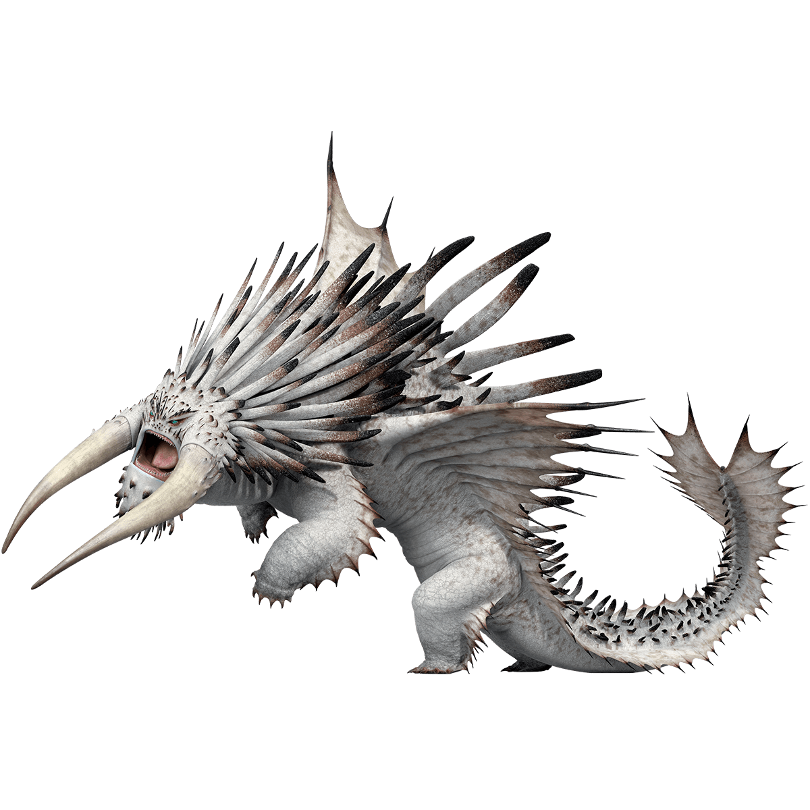
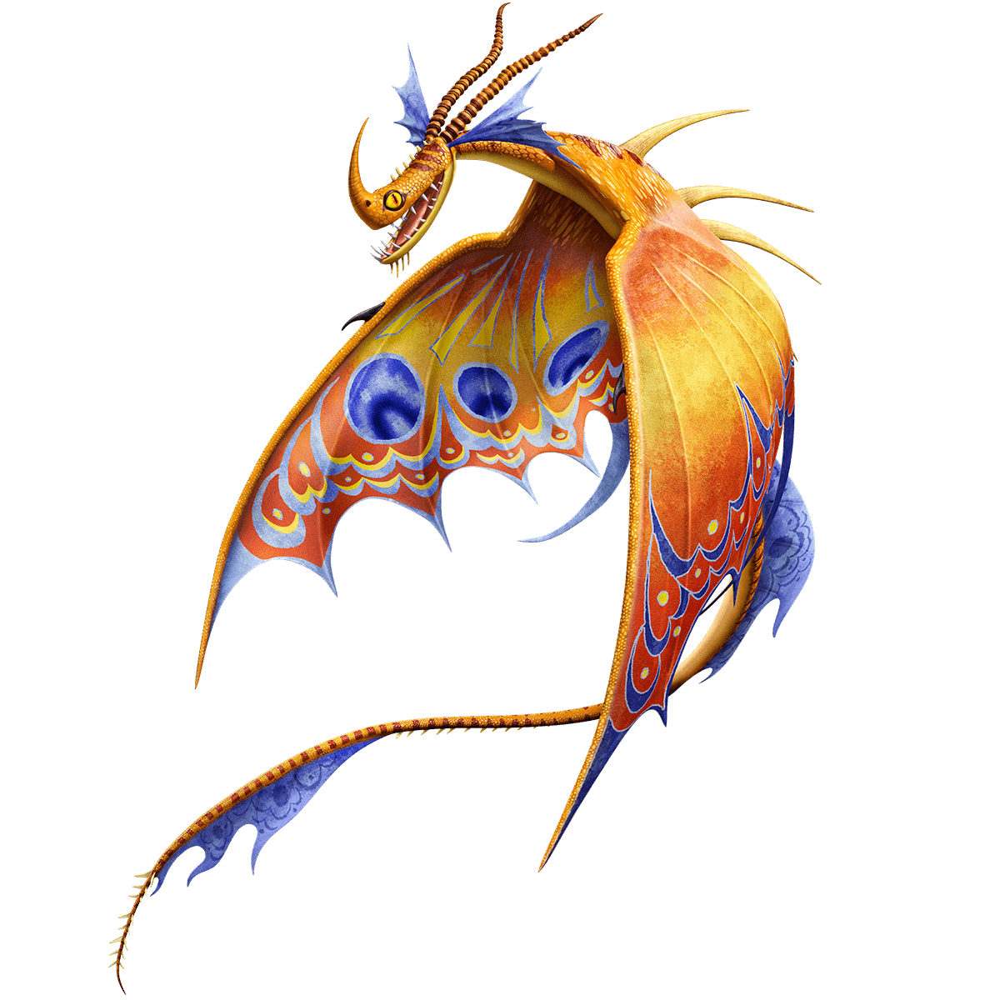
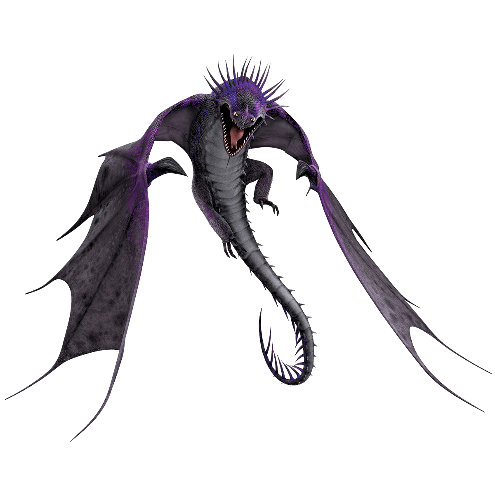

```{r setup, include=FALSE}
knitr::opts_chunk$set(echo = TRUE)
```

## Project Info
#### **GitHub user name**: Wuris
#### **Date**: 2022/3/9
#### **GitHub Link**: https://github.com/Wuris/Biol432_A6.git


```{r message=FALSE, warning=FALSE}
# Load the packages
library(ape)
library(reshape2)
library(ggplot2)
library(ggtree)
```


### Import Nexus Data
```{r}
# Input the data
DragonNexus <- read.nexus.data("./input/A7_Wu_Chenyang_DragonMatrix.nex")

# Check if everything is fine
head(DragonNexus)
names(DragonNexus)
```

### Introduction of the added dragons
#### All three of them were created by *DraemWorks Animation*
### First dragon: [VALKA'S BEWILDERBEAST](https://www.dreamworks.com/how-to-train-your-dragon/explore/valkas-bewilderbeast)
##### SPECIES: BEWILDERBEAST
##### CLASS: TIDAL
##### Labeled: 75DreamWXX


#### **As with all members of the animal kingdom, dragons, too, must follow a hierarchy of power and leadership.**
#### At the apex of that chain of command rules an exceedingly rare alpha dragon to which all others bow – the Bewilderbeast. However, Bewilderbeasts are not born to that alpha status; it is earned through combat, vigilance and, most importantly, a desire to protect the dragons in its nest. Fortunately for Bewilderbeasts, there are few other dragons in the world that can match their intimidating stature and ever hope to compete for the designation of "king of all dragons."

### Second dragon: [DEATH SONG](https://www.dreamworks.com/how-to-train-your-dragon/explore/death-song)
##### SPECIES: DEATH SONG
##### CLASS: MYSTERY
##### Labeled: 76DreamWXX


#### **Rather than shooting fire, the Death Song spits thick amber-like substance at its prey to form an impenetrable cocoon.**
#### Although deceptively beautiful in appearance and melody, the Death Song has a lethal quality that is reminiscent of the Black Widow. Inhabiting a lush island beyond the archipelago, this dragon vocalizes its beautiful and hypnotic siren call in order to lure other dragons, which it then targets as prey. Rather than using fire to attack, the Death Song shoots out a liquid substance which traps and preserves victims as it hardens into a stiff amber cocoon that is penetrable only by flame. Typically, the Death Song chooses to entrap dragons only, but it also preys upon any humans unfortunate enough to make their way to its island. Its key weaknesses are Thunderdrums, which find themselves mostly immune due to the Death Song's lethal lullaby due to poor hearing, and small enclosed spaces which can render it vulnerable to its own song.

### Third dragon: [SKRILL](https://www.dreamworks.com/how-to-train-your-dragon/explore/skrill)
##### SPECIES: SKRILL
##### CLASS: STRIKE
##### Labeled: 77DreamWXX


#### **One of the most mysterious and feared species in the Book of Dragons, the Skrill is aggressive, powerful and nearly untrainable.**

#### Skrills do not breathe fire. Instead, they channel lightning down their metallic spines, firing it from their mouths in a shower of destructive blasts. They can also store this electrical power in their bodies and release it later on.


### Calculate the distance matrix with weights
```{r warning=FALSE}
# Use 'reshape2' and 'ggplot2' packages here
# Input the data with a set of weights
WeightsDat <- read.csv("./input/Weights.csv")

# Create a single vector of weights
Weights <- paste0(WeightsDat$Weight, collapse = "")
Weights <- strsplit(Weights, split = "")[[1]]

# Convert each letter to a value
WeightsNum <- rep(NA, length(Weights))
for(i in 1:length(WeightsNum)){
  if(Weights[i] %in% LETTERS){
    WeightsNum[i] <- which(LETTERS == Weights[i]) + 9
  } else {
    WeightsNum[i] <- Weights[i]
  }
}
WeightsNum <- as.numeric(WeightsNum)

# Multiply the weight value by the trait vector for each dragon
WtDragonNexus <- DragonNexus 
for (i in 1:length(DragonNexus)){
  RepWeight <- DragonNexus[[i]] == 1
  WtDragonNexus[[i]][RepWeight] <- WeightsNum[RepWeight]
  RepWeight <- NA
}

# Calculate the distance matrix
  # Create a new dataframe with the unlisted data from DragonNexus
WtDragonNexusDF <- data.frame(
  matrix(unlist(WtDragonNexus), ncol = 78, byrow = T)
)
  # Rename the rows of new dataframe
row.names(WtDragonNexusDF) <- names(WtDragonNexus)
  # Make the distance matrix
WtDragonDist <- dist(WtDragonNexusDF, method = 'euclidean')
WtDragonDistMat <- as.matrix(WtDragonDist)

# Visualize the distance matrix
WtPDat <- melt(WtDragonDistMat)
ggplot(data = WtPDat, aes(x = Var1, y = Var2, fill = value)) + 
  geom_tile() + 
  scale_fill_gradientn(colours = c("white", "blue", "green", "red")) +
  theme(axis.text.x = element_text(angle = 90, hjust = 1, vjust = 0.5))
```

#### Fig. 4 The distance matrix with a set of weights

### Tree Building
```{r}
# Use 'ggtree' package here
WtDragonTree<-fastme.bal(WtDragonDist)

Country <- gsub("[0-9\\.]+([^X]+)X*", "\\1", WtDragonTree$tip.label) 

CountryGroups <- split(WtDragonTree$tip.label, Country)
WtDTcol <- groupOTU(WtDragonTree, c("75DreamWXX", "76DreamWXX", "77DreamWXX"))

ggtree(WtDTcol, layout = "circular", aes(colour = group)) + 
  geom_tiplab(size = 2, aes(angle = angle)) +
  scale_color_manual(values = c("black", "turquoise"), label = c("Other dragon", "My dragon"))
```

#### Fig. 5 The phylogeny tree of dragons(Blue denotes the added dragons)


